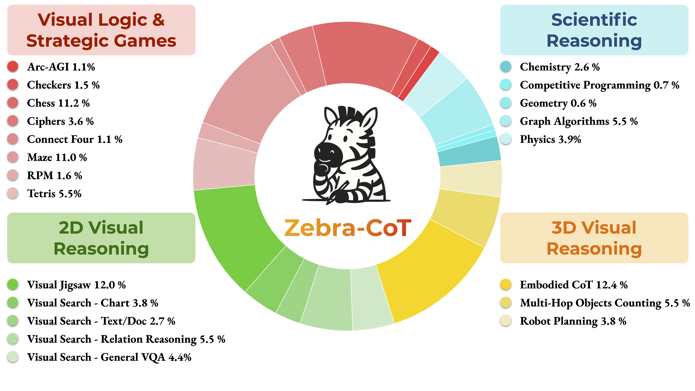

# Zebra-CoT: A Dataset for Interleaved Vision-Language Reasoning


### BAGEL Training Zebra-CoT

This repository is adapted from the [Bagel](https://github.com/ByteDance-Seed/Bagel) repository.
### Setup

```bash
git clone https://github.com/multimodal-reasoning-lab/Bagel-Zebra-CoT.git
cd Bagel-Zebra-CoT
conda create -n bagel python=3.10 -y
conda activate bagel
pip install -r requirements.txt
pip install flash_attn --no-build-isolation
```

### Download checkpoint

Set the `HF_HOME` in `download_model.py` to the path of the checkpoint you want to download.

```bash
python download_model.py
```

You can also do this straight from python if your `HF_HOME` has already been set.
```python
from huggingface_hub import snapshot_download

snapshot_download(
  repo_id="multimodal-reasoning-lab/Bagel-Zebra-CoT",
  local_dir_use_symlinks=False,
  resume_download=True,
  allow_patterns=["*.json", "*.safetensors", "*.bin", "*.py", "*.md", "*.txt"],
)
```

### Inference


The inference script (`infz_bf16.py`) supports inherent interleaved text and visual reasoning. To customize it for your
specific use case:

##### 1. Model Checkpoint Path

Update the checkpoint path to point to your model:

```python
checkpoint_dir = "/path/to/your/HF_HOME/models/Bagel-Zebra-CoT"
```
/scratch/by2593/hf_cache/hub/BAGEL-7B-MoT

ByteDance-Seed/BAGEL-7B-MoT

For example, under the `HF_HOME`, the path to the checkpoint folder is:

```bash
checkpoint_dir = f"{HF_HOME}/models--multimodal-reasoning-lab--Bagel-Zebra-CoT/snapshots/c1ff3c56dd5909841523e3a6b554c77d919c2b28
```

You can also use the local dir:

```
checkpoint_dir = f"{HF_HOME}/models/Bagel-Zebra-CoT
```

##### 2. Setting up prompt and images

Edit the prompt and image variables in `infz_bf16.py` (around lines 203-211):

**For single image problems:**
```python
prompt = "Your question here"
image = Image.open('path/to/your/image.png')
```

**For multiple image problems:**
```python
prompt = "Your question about multiple images"
image_1 = Image.open('path/to/image1.jpg')
image_2 = Image.open('path/to/image2.jpg')
image_3 = Image.open('path/to/image3.jpg')
image = [image_1, image_2, image_3]  # List of images
```

**For text-only problems:**
```python
prompt = "Your text-only question"
image = None
```

##### 3. Inference Parameters

You can adjust the generation parameters in the `inference_hyper` dictionary:

```python
inference_hyper = dict(
    do_sample=True,
    text_temperature=0.3,
    cfg_text_scale=4.0,
    cfg_img_scale=2.0,
    cfg_interval=[0.0, 1.0],
    timestep_shift=3.0,
    num_timesteps=50,
    cfg_renorm_min=0.0,
    cfg_renorm_type="text_channel",
)
```

For details, refer to the original jupyter notebook [here](inference.ipynb).

#### Example Use Cases

```python
prompt = "Subtract all cylinders. Add 1 red sphere. How many objects are left?"
image = Image.open('test_images/image.png')
```

### Training
For training, run

```bash
bash scripts/train.sh
```

For details, please refer to the original repo [README](https://github.com/bytedance-seed/BAGEL).

The interleaved reasoning data customized for Zebra-CoT can be found in [think_trace_dataset.py](data/interleave_datasets/think_trace_dataset.py).

### Cite
```bibtex
@misc{li2025zebracot,
      title={Zebra-CoT: A Dataset for Interleaved Vision Language Reasoning},
      author={Ang Li and Charles Wang and Kaiyu Yue and Zikui Cai and Ollie Liu and Deqing Fu and Peng Guo and Wang Bill Zhu and Vatsal Sharan and Robin Jia and Willie Neiswanger and Furong Huang and Tom Goldstein and Micah Goldblum},
      year={2025},
      eprint={2507.16746},
      archivePrefix={arXiv},
      primaryClass={cs.CV},
      url={https://arxiv.org/abs/2507.16746},
}
```
